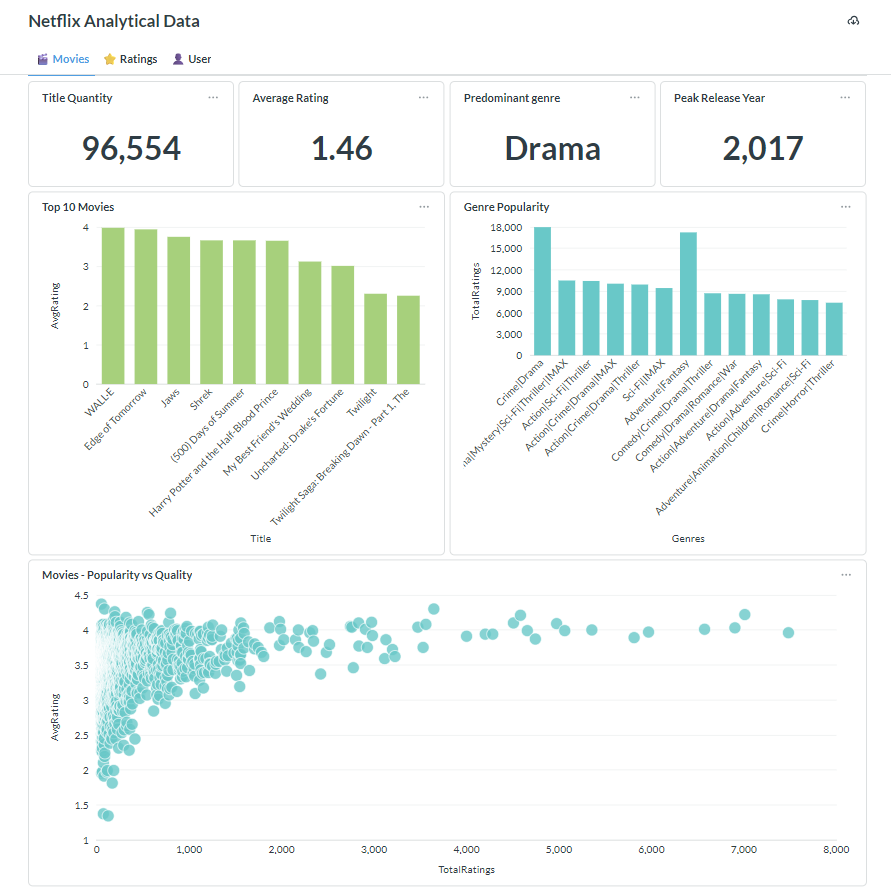
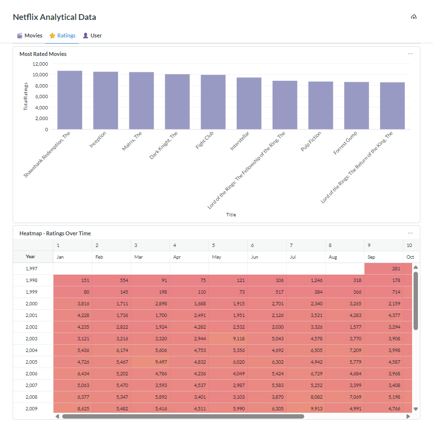
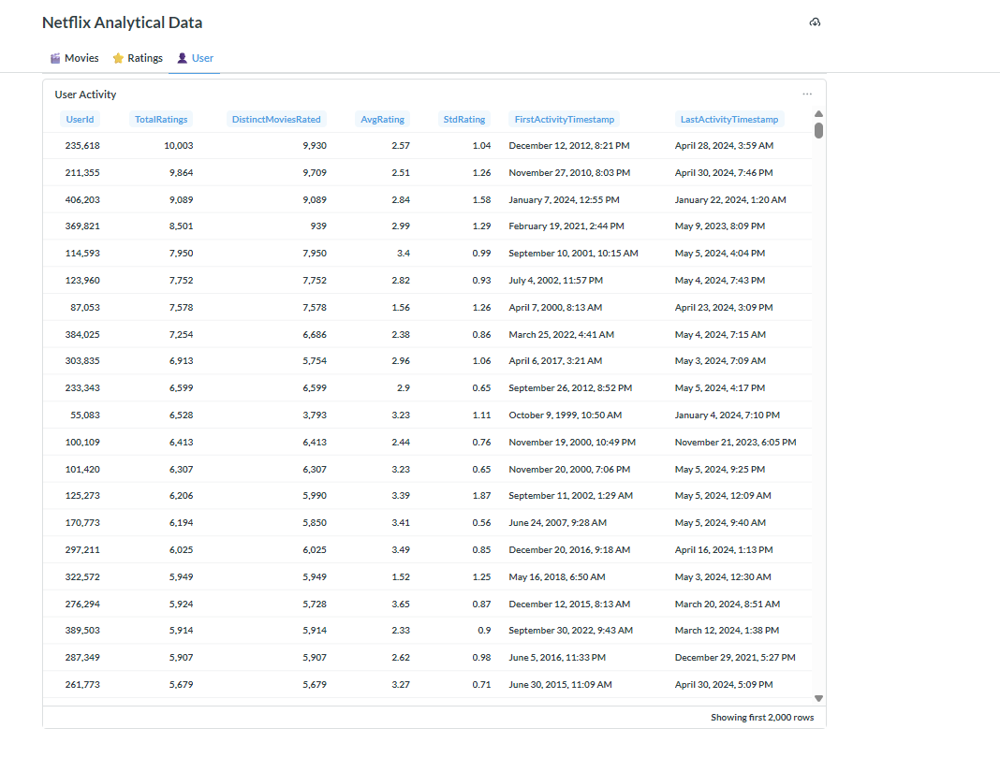

# 🎬 Movies Dashboard: End-to-End Data Engineering Project

> Transforming raw movie rating data into strategic insights on consumer behavior, engagement seasonality, and catalog performance.

This project demonstrates a comprehensive data engineering pipeline, from raw data ingestion to advanced analytics and interactive visualization, using **Google Cloud Platform (GCP)**, **BigQuery**, **Docker**, and **Metabase**.

## 🏗️ Pipeline Architecture

[Pipeline Architecture](project/assets/img/architecture.png)

The data flows through a structured multi-layer architecture (Medallion Architecture) within BigQuery:

```text
GCS (Data Lake)
      │
      ▼
BigQuery - Bronze Layer (Raw External Tables)
      │
      ▼
BigQuery - Silver Layer (Cleaned & Normalized)
      │
      ▼
BigQuery - Gold Layer (Aggregated Tables)
      │
      ▼
BigQuery - Views Layer (Business Logic for BI)
      │
      ▼
Metabase (via Docker)
   Interactive Dashboards
```

### Data Layers Detail

| Layer      | BigQuery Dataset | Description                                                                          |
| :--------- | :--------------- | :----------------------------------------------------------------------------------- |
| **Bronze** | `bronze_data`    | External tables pointing directly to CSV files stored in Google Cloud Storage (GCS). |
| **Silver** | `silver_data`    | Cleaned, typed, and normalized tables (Dimensions and Facts).                        |
| **Gold**   | `gold_data`      | Aggregated tables optimized for performance-optimized analytics.                     |
| **Views**  | `views_data`     | Logical views designed for direct consumption by BI tools like Metabase.             |

---

## 🛠️ Tech Stack

| Technology         | Purpose                                                     |
| :----------------- | :---------------------------------------------------------- |
| **GCP**            | Cloud infrastructure and managed services.                  |
| **GCS**            | Data Lake storage for raw CSV files.                        |
| **BigQuery**       | Data Warehouse for scalable transformations and analytics.  |
| **Metabase**       | Open-source BI tool for visualization and dashboards.       |
| **Docker**         | Containerization for consistent deployment of Metabase.     |
| **SQL (Standard)** | Data manipulation, transformation logic, and view creation. |

---

## 📁 Project Structure

```text
Netflix/
├── database/                           # SQL transformation logic
│   ├── bronze_data/                    # Raw layer setup scripts
│   ├── silver_data/                    # Normalization and cleaning scripts
│   ├── gold_data/                      # Aggregation and KPI scripts
│   └── views_data/                     # Final views for BI consumption
├── project/                            # Project assets and documentation
│   ├── assets/                         # Media and data samples
├── scripts/                            # Automation shell scripts
│   ├── setup_infra.sh                  # Infrastructure provisioning
│   ├── create_bronze_tables.sh         # Bronze layer external tables
│   ├── create_silver_gold_transform.sh # Core transformations
│   ├── create_views.sh                 # Final BI views setup
│   └── run_pipeline_setup.sh           # Main pipeline orchestrator
├── docker-compose.yml                  # Metabase deployment configuration
├── .env                                # Environment variables (ignored by git)
├── .env.example                        # Template for required variables
├── .gitignore
└── README.md
```

---

## ⚙️ Execution & Setup

### Prerequisites

*   **Google Cloud Account:** Project ID and Service Account with BigQuery/GCS permissions.
*   **Dataset:** Download and extract files to the `data/` folder. Source: [MovieLens Dataset](https://grouplens.org/datasets/movielens/ml_belief_2024/)
*   **Tools:** `gcloud` CLI, `bq` CLI, and **Docker** installed.

### Configuration

Create a `.env` file based on `.env.example`:
```bash
GCP_PROJECT_ID="your-project-id"
GCP_REGION="your-project-region"
BRONZE_DATASET="raw_data"
SILVER_DATASET="silver_data"
GOLD_DATASET="gold_data"
VIEWS_DATASET="views_data"
BUCKET_NAME="your-gcs-bucket"
FOLDER_NAME="your-gcs-bucket-data-folder"

```

### Running the Pipeline

Execute the main orchestrator to provision infrastructure and process data:
```bash
chmod +x scripts/run_pipeline_setup.sh
./scripts/run_pipeline_setup.sh
```

### Deploying Metabase

Run Metabase locally using Docker:
```bash
docker run -d -p 3000:3000 --name metabase metabase/metabase
```

OR

```bash
docker compose up -d
```

Access `http://localhost:3000` and connect to BigQuery using your Service Account JSON key.

---

## 📊 Core Analytics & SQL Logic

The project applies advanced SQL techniques across layers:

- **Bronze to Silver**: Type casting, date parsing, and string normalization.

- **Silver to Gold**: Complex aggregations for movie performance and user behavior.

- **Views Layer**: Final business-friendly views like `vw_movie_kpis` and `vw_genre_performance`.

---

## 📸 Dashboards





The final output consists of three specialized dashboard tabs in Metabase:

| Tab         | Key Visualizations                                                                |
| :---------- | :-------------------------------------------------------------------------------- |
| **Movies**  | KPI cards, Top 10 Movies, Genre Performance, Popularity vs. Quality Scatter Plot. |
| **Ratings** | Activity Heatmap (Day/Hour), Temporal Evolution of engagement.                    |
| **Users**   | User activity distribution and rating behavior analysis.                          |
